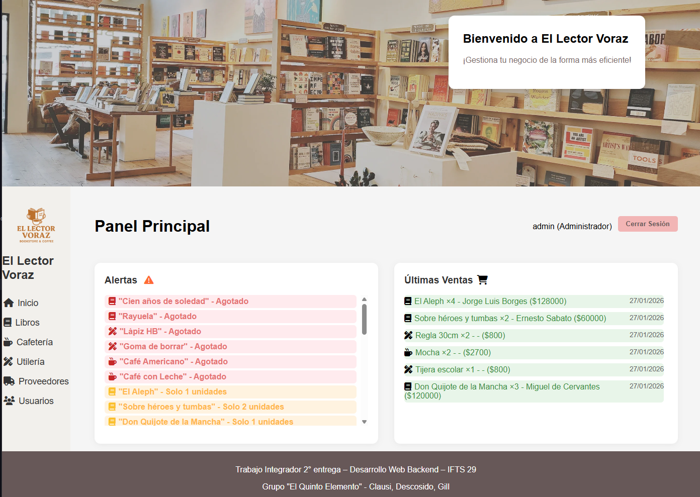
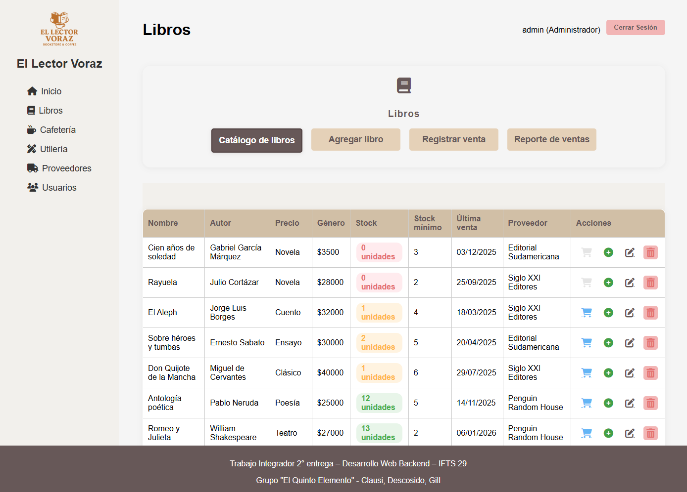
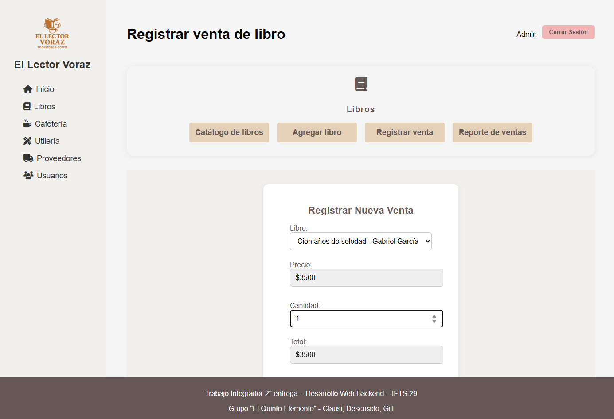
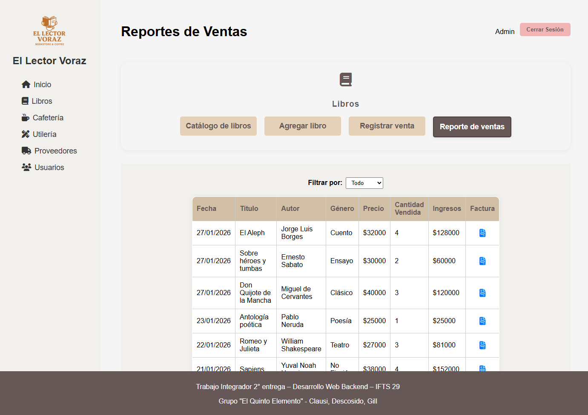

# El Lector Voraz – Sistema de Gestión para Librería

<div align="center">

[](https://nodejs.org/)
[](https://expressjs.com/)
[](https://www.mongodb.com/)
[](https://pugjs.org/)
[](https://jestjs.io/)

**Solución integral para la digitalización administrativa y comercial de librerías**  
*Gestión de stock · Dashboard de ventas · Control de proveedores · Módulo de Cafetería*

[Ver Repositorio Original](https://github.com/TDS-IFTS29/El-Quinto-Elemento_Libreria-El-lector-Voraz_2_Comision-D)

</div>

---

## Tabla de Contenidos
- [Origen y Créditos](#origen-y-créditos)
- [Diferenciación de Portfolio](#diferenciación-de-portfolio)
- [Sobre el Proyecto](#sobre-el-proyecto)
- [Características Principales](#características-principales)
- [Stack Tecnológico](#stack-tecnológico)
- [Capturas de Pantalla](#capturas-de-pantalla)
- [Instalación](#instalación)
- [Uso](#uso)
- [Sistema de Permisos](#sistema-de-permisos)
- [Testing](#testing)

---

## Origen y Créditos
> **Este proyecto fue desarrollado como el Trabajo Integrador Final** de la materia Desarrollo Web Backend en la Tecnicatura en Desarrollo de Software (IFTS 29).

### Equipo Original
- **Clausi Damián Andrés**: Diseño de Base de Datos, Módulo de Librería con Reportes, CRUD de productos y modularización.
- **Descosido Cristian**: Gestión de proveedores, Vistas dinámicas, Módulo Coffee con Reportes y Sistema de Login.
- **César Antonio Gill**: Registro de ventas, Módulo Utilería, Reportes y Despliegue en Atlas/Render.

---

## Diferenciación de Portfolio
Este repositorio es mi **versión personal de portfolio** adaptada para demostrar mis habilidades como desarrollador Backend de forma independiente.

### ¿Por qué este repositorio?
- **Portfolio Profesional**: Optimizado para ser presentado a reclutadores, destacando mi rol en el diseño de la base de datos y la arquitectura MVC.
- **Mejoras Implementadas**: Refactorización de controladores, optimización de queries en Mongoose y documentación técnica exhaustiva.
- **Demostración de Habilidades**: Muestra mi capacidad de gestionar un sistema complejo con múltiples módulos y roles de usuario.

---

## Sobre el Proyecto
### El Lector Voraz (SGE)
El sistema digitaliza la gestión de una librería física que integra servicios de cafetería y venta de utilería. El objetivo principal es centralizar la toma de decisiones basada en datos reales de ventas y stock.

### Problema que Resuelve
Muchas librerías pequeñas gestionan sus inventarios de forma manual o descentralizada, lo que dificulta el seguimiento de ventas, la reposición de stock y la rentabilidad por departamentos.

### Solución Implementada
Una aplicación web robusta con arquitectura **MVC**, que ofrece una **API RESTful** para la manipulación de datos y un cliente dinámico con **vistas Pug** renderizadas del lado del servidor, integrando reportes estadísticos en tiempo real.

---

## Características Principales

#### 📚 Módulo de Librería
- CRUD completo de libros con gestión de stock mínimo y alertas.
- Historial de ventas detallado y facturación.

#### ☕ Módulo de Cafetería
- Venta de productos de consumo inmediato con control de insumos.
- Reportes específicos de consumo diario.

#### 📎 Módulo de Utilería
- Gestión de artículos de papelería y oficina.
- Tracking de reposición de proveedores.

#### 📊 Dashboard y Reportes
- Visualización dinámica de productos más vendidos.
- Gráficos de tendencias de ventas semanales.

---

## Stack Tecnológico

### Backend
```yaml
Core:
  - Node.js (v18+)
  - Express.js (v5.1.0)

Base de Datos:
  - MongoDB
  - Mongoose (ODM)

Autenticación:
  - Express Session
  - Bcrypt (Hashing de contraseñas)

Renderizado:
  - Pug (Template engine)
```

### Arquitectura
```
Proyecto
├── controllers/       # Lógica de negocio (MVC)
├── models/            # Esquemas de Mongoose
├── routes/            # Definición de rutas (Web y API)
├── middleware/        # Autenticación y permisos (RBAC)
├── views/             # Plantillas Pug
├── public/            # Archivos estáticos (CSS, JS, Img)
└── __tests__/         # Suite de testing con Jest
```

---

## Capturas de Pantalla

#### Dashboard Principal

*Vista general del sistema con estadísticas y accesos rápidos.*

#### Catálogo de Libros

*Gestión de inventario con indicadores de stock bajo y acciones administrativas.*

#### Registro de Ventas

*Interfaz fluida para el registro de transacciones en los tres departamentos.*

#### Reportes Estadísticos

*Visualización de datos sobre productos más vendidos y tendencias de la semana.*

---

## Instalación

### Requisitos Previos
- Node.js v18.0.0 o superior
- MongoDB local o Atlas
- npm

### 1. Clonar el repositorio
```bash
git clone https://github.com/damianclausi/libreria-el-lector-voraz.git
cd libreria-el-lector-voraz
```

### 2. Instalar dependencias
```bash
npm install
```

### 3. Configurar variables de entorno
Crea un archivo `.env` en la raíz con:
```bash
PORT=3000
MONGO_URI=mongodb://localhost:27017/el-lector-voraz
SESSION_SECRET=tu-clave-secreta-aqui
```

### 3.5. MongoDB con Docker (Opcional)
Si prefieres usar Docker en lugar de una instalación local de MongoDB:
```bash
docker run -d --name mongodb -p 27017:27017 mongo
```

### 4. Poblar la base de datos
Ejecuta el script de semilla para cargar datos de prueba:
```bash
node crear_base_el_lector_voraz.js
```

### 5. Iniciar la aplicación
```bash
# Modo Desarrollo
npm run dev

# Modo Producción
npm start
```

---

## Uso

### Usuarios de Prueba (Contraseña: 1234)
| Usuario | Email | Rol |
|---------|-------|-----|
| Juan Pérez | juan.perez@lectorvoraz.com | Administrador |
| Antonio Gill | antonio.gill@lectorvoraz.com | Empleado |

---

## Sistema de Permisos
Implementa un control de acceso basado en roles (**RBAC**):

- **Administrador**: Control total sobre usuarios, libros, proveedores y reportes globales.
- **Empleado**: Registro de ventas, visualización de catálogo y gestión de su propio perfil.

---

## Testing
La aplicación cuenta con una amplia cobertura de tests automatizados para asegurar la integridad de la API.

```bash
# Ejecutar todos los tests
npm test
```
- **Tests de Integración**: 123 tests pasando exitosamente.
- **Validación de Permisos**: Tests específicos para cada rol de usuario.
- **Mocking**: Configuración de entorno de prueba aislado en `jest.setup.js`.

---
